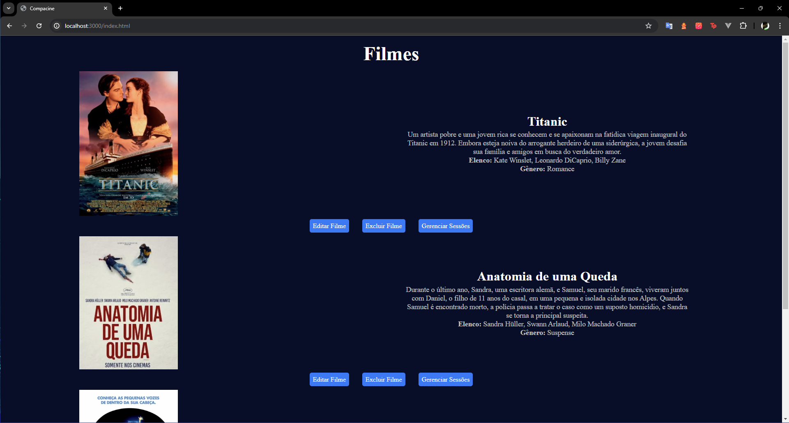

# Desafio - Projeto Compacine

- Repositório utilizada para desenvolver o projeto Compacine, proposto como desafio para a etapa 2 de backend do projeto Fast Track.
- O projeto apresenta as funcionalidades de cadastro, edição, listagem e exclusão de filmes, sessões e ingressos, além da compra de ingressos:

## API
- A API Compacine possui 3 rotas principais para realizarmos o CRUD de filmes, sessões e ingressos:
    - /movies
    - /sessions
    - /tickets
- As funcionalidades de cada rota são configuradas pelos controllers e routes, permitindo a alteração dos dados de acordo com as regras de negócios.

## Instalação
- *Atenção!* É necessário ter o NodeJS instalado.
- Para iniciar é necessário realizar o `git clone` do projeto e entrar no seu editor de código favorito;
- Dentro do editor, abra o terminal e rode o comando `npm install` ou `npm i` para instalar as dependências do projeto;
- 

## Execução
- Com as instalações e configurações feitas com sucesso, é possível rodar o projeto com o comando `npm run start`;
- Quando pronto pra acessar, o terminal apresentará as informações "Servidor rodando na porta 3000" e "Banco de dados conectado com sucesso", então basta apenas acessar `http://localhost:3000/` par acessar a aplicação.

## Tecnologias
- JavaScript, HTML e CSS
